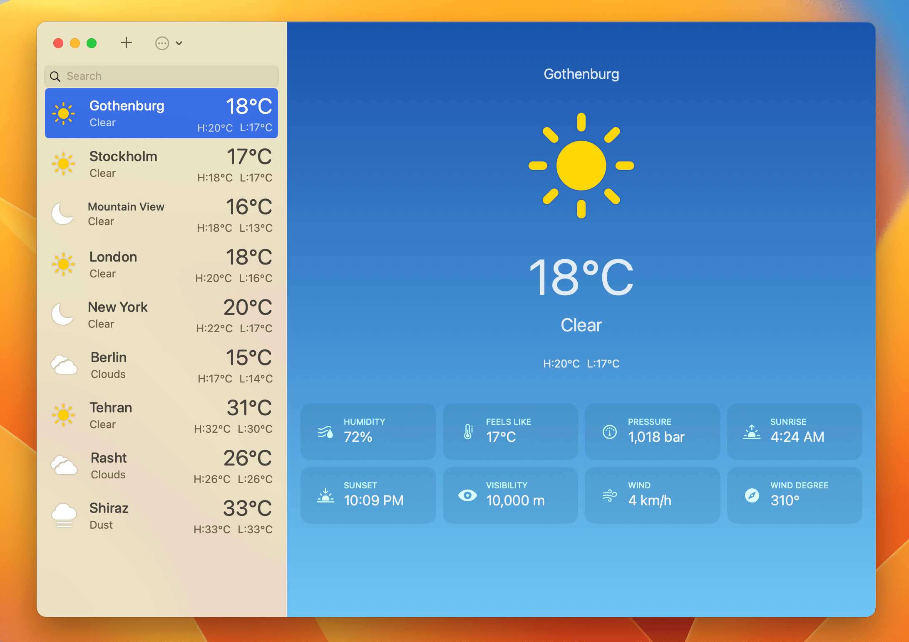

  
  <h1 align="center">Weather</h1>
	<h4 align="center">An OpenWeatherMap client for iOS and macOS</h4>

### Configure the project 🛠

- Clone the project
- Open __`Config.xconfig`__ file with any editor except **xcode** and change __`WEATHER_APP_ID`__'s value to your **new app bundle identifier**. Also change __`OPEN_WEATHER_API_KEY`__'s value to your OpenWeatherMap API Key (you can obtain it [here](https://openweathermap.org/api)).
- Open the __`Weather.xcodeproj`__ file with xcode, open the project's file and go to __`Signing & Capabilities`__ and change the __`team`__.
- Build & run.

### Previews 📱

### License 📝

Licensed under the [GNU GENERAL PUBLIC LICENSE Version 3](https://github.com/Rminsh/Weather/blob/main/LICENSE.md).
